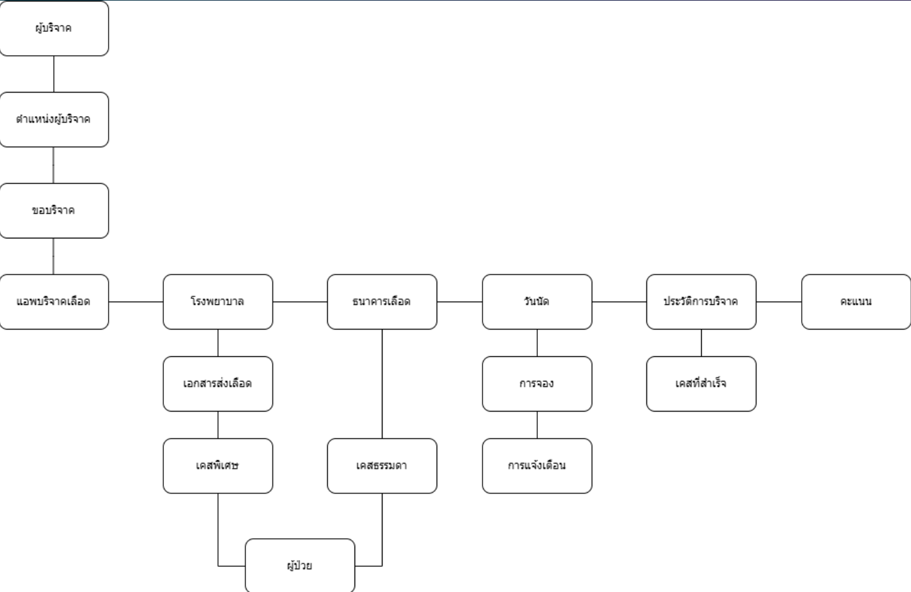

## Blood Donation Management System (System Analysis)

โปรเจกต์นี้เป็นการวิเคราะห์และออกแบบระบบ (System Analysis) สำหรับแพลตฟอร์มการบริจาคเลือด โดยโฟกัสที่การออกแบบ Business Logic และเส้นทางการใช้งานของผู้ใช้ (User Journey) ตั้งแต่ฝั่งผู้บริจาคไปจนถึงฝั่งโรงพยาบาล

### System Architecture & Conceptual Flow

จากการออกแบบ System Flow ในภาพรวม ระบบถูกออกแบบให้รองรับการจัดการข้อมูลแบบ End-to-End โดยมีจุดเด่นดังนี้:
* **Location-Based Matching:** ระบบประมวลผลตำแหน่ง (GPS) ของผู้บริจาค เพื่อจับคู่กับความต้องการของโรงพยาบาลหรือธนาคารเลือดที่อยู่ใกล้เคียง 
* **Case Classification:** มีการแบ่งประเภทการขอรับบริจาคเป็น "เคสทั่วไป" และ "เคสพิเศษ" ซึ่งส่งผลต่อ Logic การแจ้งเตือนและการจองคิวของผู้บริจาค
* **Incentive Tracking:** ออกแบบระบบจัดเก็บประวัติและให้คะแนน (Scoring System) อัตโนมัติเมื่อจบเคส เพื่อกระตุ้นให้เกิดการบริจาคซ้ำ (Retention)
